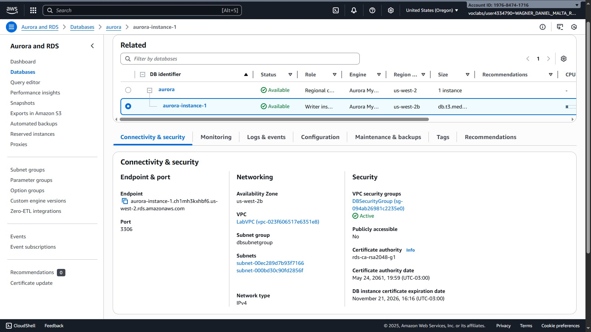
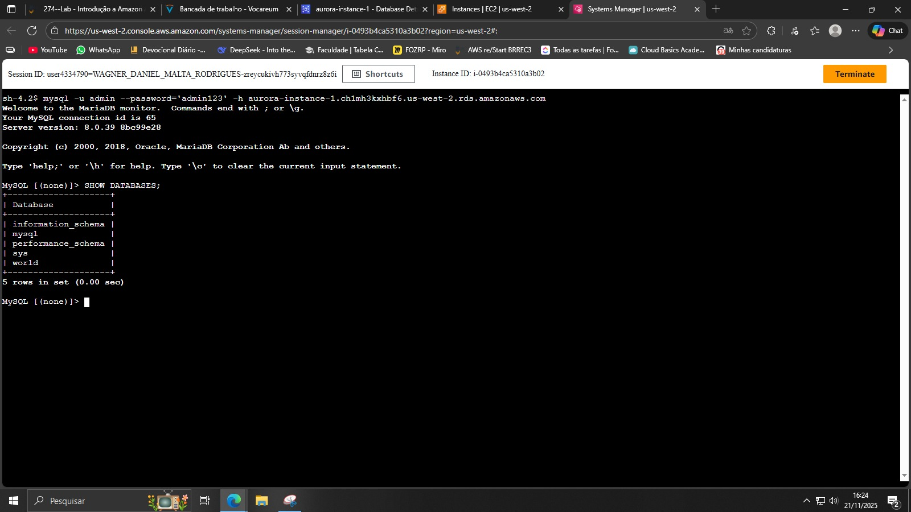
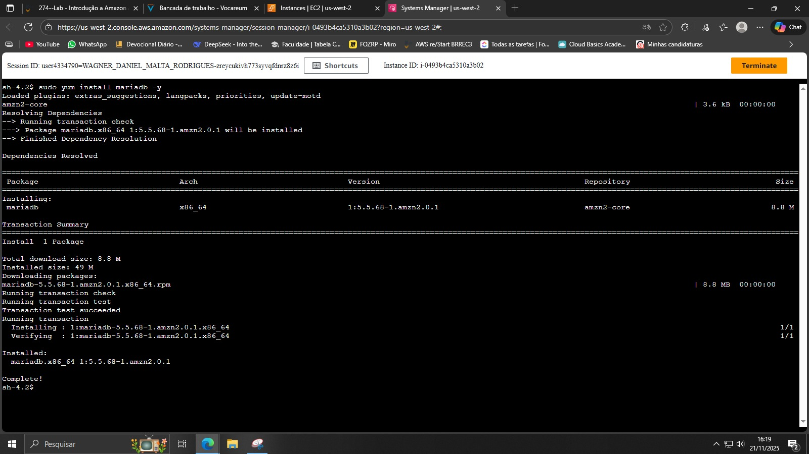
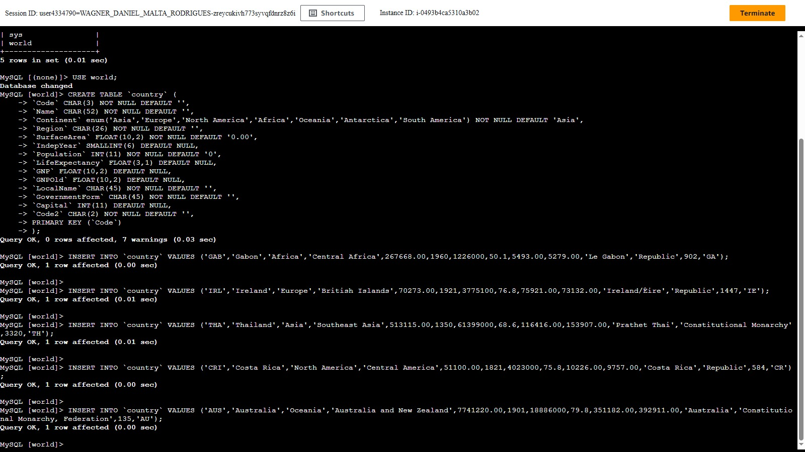
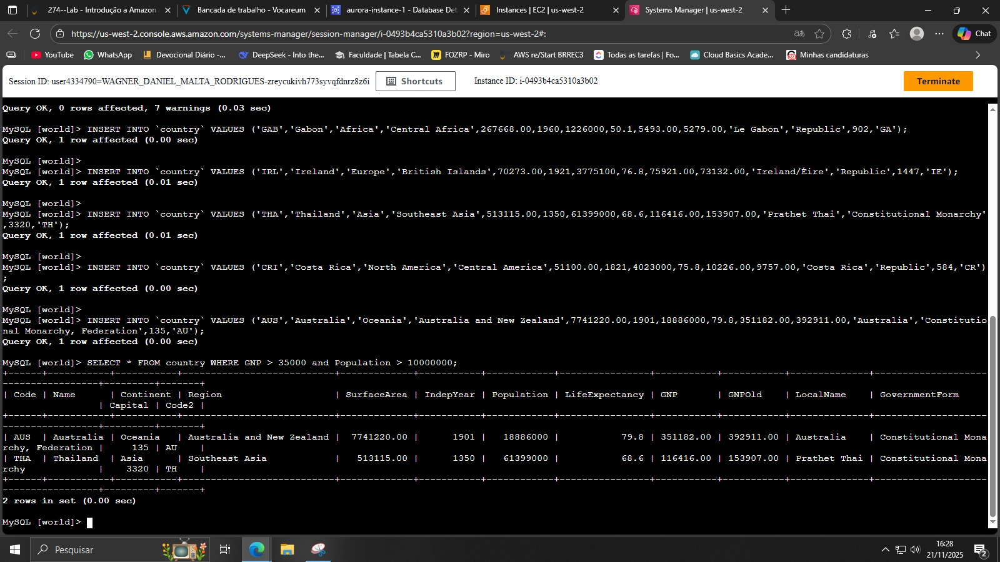

# 🗄️ Laboratório AWS — Amazon Aurora

   

Este repositório documenta um laboratório prático ao Amazon Aurora, serviço de banco de dados relacional totalmente gerenciado compatível com MySQL, oferecendo até 5x o desempenho do MySQL tradicional.

---

## 🎯 Objetivos do Laboratório

Após a execução do laboratório, o aluno será capaz de:

- Criar uma instância **Amazon Aurora** compatível com MySQL
- Conectar a uma instância **Amazon EC2** pré-configurada
- Configurar o cliente MySQL para conexão com Aurora
- Executar operações **SQL** (CREATE, INSERT, SELECT)
- Gerenciar tabelas e consultar dados no Aurora

---

## 📋 Arquitetura do Laboratório

| Componente | Descrição | Configuração |
|------------|-----------|--------------|
| **Aurora Cluster** | Banco de dados gerenciado | MySQL 8.0, db.t3.medium |
| **EC2 Instance** | Command Host | Amazon Linux 2 |
| **Network** | VPC privada | LabVPC, Subnet Group |
| **Security** | Grupos de segurança | DBSecurityGroup |

---

## 🛠️ Execução do Laboratório

### 1) Conexão ao EC2 Command Host

**Acesso via Session Manager:**
- Instância: Command Host
- Método: AWS Systems Manager Session Manager
- Sistema: Amazon Linux 2

### 2) Criação do Cluster Aurora


**Configuração do cluster:**
```bash
Método de criação: Padrão
Engine: Aurora (MySQL Compatible)
Versão: MySQL 8.0
Template: Dev/Test
Cluster Identifier: aurora
Credenciais: admin / admin123
Instance Class: db.t3.medium
Multi-AZ: Não (ambiente de lab)
VPC: LabVPC
Subnet Group: dbsubnetgroup
Security Group: DBSecurityGroup
Database Name: world
```

**Características especiais:**
- ✅ Criptografia ativada
- ✅ Monitoramento aprimorado
- ✅ Atualização automática de versões menores
- 🔒 Acesso público: Não

### 3) Verificação do Ambiente de Banco de Dados


**Listagem dos bancos disponíveis:**
```sql
SHOW DATABASES;
```
**Resultado:**
```
+--------------------+
| Database           |
+--------------------+
| information_schema |
| mysql              |
| performance_schema |
| sys                |
| world              |
+--------------------+
5 rows in set (0.01 sec)
```

### 4) Instalação do Cliente MariaDB


**Comando de instalação:**
```bash
sudo yum install mariadb -y
```

**Status da instalação:**
- Pacote: mariadb-5.5.68-1.amzn2.0.1.x86_64
- Tamanho: 8.8 MB download, 49 MB instalado
- Transação concluída com sucesso

### 5) Conexão ao Aurora Cluster
**Endpoint do cluster:**
```
aurora-instance-1.ch1mh3b4bf6.us-west-2.rds.amazonaws.com:3306
```

**Comando de conexão:**
```bash
mysql -u admin --password='admin123' -h <endpoint_aurora>
```

**Conexão estabelecida:**
- MySQL connection id: 173
- Server version: 8.0.28 Source distribution
- Prompt: MySQL [(none)]>

### 6) Operações no Banco de Dados

#### 📊 Estrutura do Schema
```sql
SHOW DATABASES;
-- information_schema, mysql, performance_schema, sys, world

USE world;
-- Database changed
```

#### 🏗️ Criação da Tabela Country


**Schema da tabela:**
```sql
CREATE TABLE `country` (
    `Code` CHAR(3) NOT NULL DEFAULT '',
    `Name` CHAR(52) NOT NULL DEFAULT '',
    `Continent` ENUM('Asia','Europe','North America','Africa','Oceania','Antarctica','South America') NOT NULL DEFAULT 'Asia',
    `Region` CHAR(26) NOT NULL DEFAULT '',
    `SurfaceArea` FLOAT(10,2) NOT NULL DEFAULT '0.00',
    `IndepYear` SMALLINT(6) DEFAULT NULL,
    `Population` INT(11) NOT NULL DEFAULT '0',
    `LifeExpectancy` FLOAT(3,1) DEFAULT NULL,
    `GNP` FLOAT(10,2) DEFAULT NULL,
    `GNPOld` FLOAT(10,2) DEFAULT NULL,
    `LocalName` CHAR(45) NOT NULL DEFAULT '',
    `GovernmentForm` CHAR(45) NOT NULL DEFAULT '',
    `Capital` INT(11) DEFAULT NULL,
    `Code2` CHAR(2) NOT NULL DEFAULT '',
    PRIMARY KEY (`Code`)
);
```
- **Status:** Query OK, 0 rows affected, 7 warnings
- **Primary Key:** Code (CHAR(3))

#### 📝 Inserção de Dados


**Países inseridos:**
```sql
-- Gabon
INSERT INTO country VALUES ('GAB','Gabon','Africa','Central Africa',267668.00,1960,1226000,50.1,5493.00,5279.00,'Le Gabon','Republic',902,'GA');

-- Irlanda
INSERT INTO country VALUES ('IRL','Ireland','Europe','British Islands',70273.00,1921,3775100,76.8,75921.00,73132.00,'Ireland/Éire','Republic',1447,'IE');

-- Tailândia
INSERT INTO country VALUES ('THA','Thailand','Asia','Southeast Asia',513115.00,1350,61399000,68.6,116416.00,153907.00,'Prathet Thai','Constitutional Monarchy',3320,'TH');

-- Costa Rica
INSERT INTO country VALUES ('CRI','Costa Rica','North America','Central America',51100.00,1821,4023000,75.8,10226.00,9757.00,'Costa Rica','Republic',584,'CR');

-- Austrália
INSERT INTO country VALUES ('AUS','Australia','Oceania','Australia and New Zealand',7741220.00,1901,18886000,79.8,351182.00,392911.00,'Australia','Constitutional Monarchy, Federation',135,'AU');
```

#### 🔍 Consulta com Filtros
**Países com GNP > 35.000 e População > 10.000.000:**
```sql
SELECT * FROM country WHERE GNP > 35000 and Population > 10000000;
```

**Resultados:**
| Code | Name | Continent | Region | SurfaceArea | Population | GNP |
|------|------|-----------|--------|-------------|------------|-----|
| AUS | Australia | Oceania | Australia and New Zealand | 7741220.00 | 18886000 | 351182.00 |
| THA | Thailand | Asia | Southeast Asia | 513115.00 | 61399000 | 116416.00 |

---

## 🏗️ Arquitetura Aurora

### Componentes do Cluster
| Componente | Tipo | Descrição |
|------------|------|-----------|
| **Cluster Endpoint** | Writer | Conexões de leitura/escrita para instância primária |
| **Reader Endpoint** | Reader | Balanceamento de carga para réplicas (somente leitura) |
| **Aurora Instance** | db.t3.medium | Instância de banco de dados computacional |

### Características de Segurança
- 🔒 **VPC Privada**: LabVPC com subnets dedicadas
- 🛡️ **Security Groups**: DBSecurityGroup restritivo
- 🔑 **Criptografia**: Ativada para dados em repouso
- 🌐 **Acesso Público**: Desativado para segurança

---

## ⚡ Performance Aurora vs MySQL

| Métrica | MySQL Tradicional | Amazon Aurora | Vantagem |
|---------|-------------------|---------------|----------|
| **Leituras** | 1x | Até 5x | 500% melhor |
| **Escritas** | 1x | Até 3x | 300% melhor |
| **Disponibilidade** | 99,95% | 99,99% | Mais resiliente |
| **Escalabilidade** | Manual | Automática | Menor overhead |

---

## 🎓 Conclusões do Laboratório

### ✅ Competências Desenvolvidas
- **Provisionamento Aurora**: Criação de clusters com configuração otimizada
- **Conectividade VPC**: Configuração de rede privada entre serviços AWS
- **Gestão de Clientes**: Instalação e configuração do MySQL Client
- **Operações SQL**: CREATE, INSERT, SELECT com filtros avançados
- **Segurança**: Configuração de grupos de segurança e criptografia

### 🔧 Lições Aprendidas
- **Aurora é totalmente gerenciado**: AWS cuida de patches, backups e escalabilidade
- **Endpoint Management**: Cluster endpoint vs Reader endpoint para diferentes cargas
- **VPC Integration**: Serviços AWS trabalham melhor em rede privada
- **Performance**: Aurora oferece melhor performance sem alterações na aplicação

### 🚀 Aplicações Práticas
- Aplicações web de alta performance
- Sistemas transacionais com alta disponibilidade
- Ambientes de desenvolvimento e teste
- Migração de workloads MySQL para cloud

---

**Laboratório concluído com sucesso**  
*AWS Training and Certification*  
*"Hands-on experience with high-performance managed database service"*

---

## 📚 Recursos Adicionais

- [Documentação Amazon Aurora](https://docs.aws.amazon.com/aurora/)
- [Aurora MySQL Compatibility](https://docs.aws.amazon.com/aurora/latest/userguide/aurora-mysql.html)
- [Best Practices for Aurora](https://docs.aws.amazon.com/aurora/latest/userguide/best-practices.html)

*© 2025 Amazon Web Services, Inc. and its affiliates. All rights reserved.*
